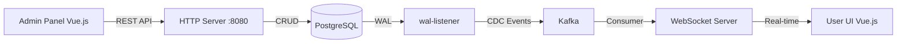

# План реализации партнёрской системы

## Архитектура (уточнённая)



**Два независимых канала:**
- **Админка** → REST API → БД (создание/редактирование партнёров, категорий, офферов)
- **Пользователь** → WebSocket ← Kafka Consumer ← wal-listener ← БД (получение обновлений в реальном времени)

---

## Текущее состояние

### ✅ Уже сделано
- Docker Compose инфраструктура (PostgreSQL 18.4, Kafka 4.3.0 KRaft, wal-listener v2.11.0)
- Миграции БД (partner, category, offer, city таблицы)
- Базовый фреймворк: загрузка конфига, логгер, HTTP сервер с middleware, обработка ответов, пул соединений с БД
- Доменная сущность `Offer` с валидацией
- Конфигурация wal-listener и проверка пайплайна (работает)

### ❌ Нужно реализовать

#### Фаза 1 — REST API для админки (сейчас)
- Доменные сущности `Partner` и `Category`
- Репозитории для работы с БД (partner, category, offer)
- Сервисы с бизнес-логикой
- HTTP обработчики CRUD
- Регистрация роутов в `cmd/server/main.go`
- Vue.js админ-панель

#### Фаза 2 — Kafka Consumer + WebSocket (потом)
- Kafka consumer инфраструктура
- WAL event consumer
- WebSocket сервер
- Пользовательский UI с real-time обновлениями

#### Фаза 3 — Тесты и улучшения
- Тесты (80% coverage)
- Исправления (bat скрипт, healthcheck, CORS)

---

## Фаза 1: REST API для админки

### 1.1 Создать `.env` файл
**Файл**: `.env` (копия `.env.example`)

### 1.2 Реализовать сущность `Partner`
**Файл**: `backend/internal/core/domain/entity/partner.go`
```go
type Partner struct {
    ID          int
    Name        string
    Description *string
}
```
- Конструктор `NewPartner(id, name, description)`
- Валидация: ID >= 0, name 1-100, description 1-1000 (если не nil)

### 1.3 Реализовать сущность `Category`
**Файл**: `backend/internal/core/domain/entity/category.go`
```go
type Category struct {
    ID          int
    Name        string
    Description *string
}
```
- Аналогичная валидация

### 1.4 Создать репозитории
**Директория**: `backend/internal/features/affiliate/repository/`

**Файлы**:
- `partner.go` — `PartnerRepository` интерфейс + `PostgresPartnerRepository`
- `category.go` — `CategoryRepository` интерфейс + `PostgresCategoryRepository`
- `offer.go` — `OfferRepository` интерфейс + `PostgresOfferRepository`

**Методы каждого репозитория:**
- `Create(ctx, entity) (int, error)` — INSERT, возвращает ID
- `GetByID(ctx, id) (entity, error)` — SELECT по ID
- `Update(ctx, entity) error` — UPDATE
- `Delete(ctx, id) error` — DELETE
- `List(ctx) ([]entity, error)` — SELECT всех записей

### 1.5 Создать сервисы
**Директория**: `backend/internal/features/affiliate/service/`

**Файлы**:
- `partner.go` — `PartnerService`
- `category.go` — `CategoryService`
- `offer.go` — `OfferService`

**Каждый сервис:**
- Принимает репозиторий через интерфейс
- Валидирует сущности перед сохранением
- Возвращает доменные ошибки (`ErrNotFound`, `ErrInvalidArgument`, `ErrConflict`)

### 1.6 Создать HTTP обработчики
**Директория**: `backend/internal/features/affiliate/handler/`

**Файлы**:
- `partner.go` — CRUD обработчики для партнёров
- `category.go` — CRUD обработчики для категорий
- `offer.go` — CRUD обработчики для предложений

**Каждый обработчик:**
- Принимает сервис через интерфейс
- Парсит тело запроса через `DecodeAndValidateRequest`
- Вызывает методы сервиса
- Возвращает ответ через `HTTPResponseHandler`

### 1.7 Регистрация роутов
**Файл**: `backend/internal/features/affiliate/routes.go`

**API Endpoints:**

| Метод | Путь | Описание |
|-------|------|----------|
| POST | /api/v1/partners | Создать партнёра |
| GET | /api/v1/partners | Список партнёров |
| GET | /api/v1/partners/{id} | Получить партнёра |
| PUT | /api/v1/partners/{id} | Обновить партнёра |
| DELETE | /api/v1/partners/{id} | Удалить партнёра |
| POST | /api/v1/categories | Создать категорию |
| GET | /api/v1/categories | Список категорий |
| GET | /api/v1/categories/{id} | Получить категорию |
| PUT | /api/v1/categories/{id} | Обновить категорию |
| DELETE | /api/v1/categories/{id} | Удалить категорию |
| POST | /api/v1/offers | Создать предложение |
| GET | /api/v1/offers | Список предложений |
| GET | /api/v1/offers/{id} | Получить предложение |
| PUT | /api/v1/offers/{id} | Обновить предложение |
| DELETE | /api/v1/offers/{id} | Удалить предложение |

### 1.8 Связать `cmd/server/main.go`
- Инициализировать пул БД
- Инициализировать репозитории
- Инициализировать сервисы
- Инициализировать обработчики
- Зарегистрировать роуты

### 1.9 Vue.js админ-панель
- Страницы: PartnerList, PartnerForm, CategoryList, CategoryForm, OfferList, OfferForm
- HTTP-клиент для вызовов REST API
- Vue Router для навигации
- Vuex для состояния

---

## Фаза 2: Kafka Consumer + WebSocket (потом)

### 2.1 Kafka consumer инфраструктура
**Директория**: `backend/internal/core/transport/kafka/`
- `consumer.go` — базовая обёртка
- `types.go` — общие типы

### 2.2 WAL event consumer
**Директория**: `backend/internal/features/events/consumer/`
- Подписка на топики wal-listener
- Парсинг JSON → доменные события

### 2.3 WebSocket сервер
- Обёртка над `gorilla/websocket` или `nhooyr.io/websocket`
- Рассылка событий подключённым клиентам

### 2.4 Пользовательский UI
- Real-time лента событий через WebSocket
- Отображение изменений в БД

---

## Фаза 3: Тесты и улучшения

### 3.1 Тесты (80% coverage)
- Юнит-тесты доменных сущностей
- Юнит-тесты сервисов (с моками)
- Интеграционные тесты репозиториев
- HTTP handler тесты (httptest)

### 3.2 Исправления
- bat скрипт: пропускать комментарии в `.env`
- Healthcheck для wal-listener
- CORS middleware

---

## Порядок создания файлов (Фаза 1)

1. `.env` (из `.env.example`)
2. `backend/internal/core/domain/entity/partner.go`
3. `backend/internal/core/domain/entity/category.go`
4. `backend/internal/features/affiliate/repository/partner.go`
5. `backend/internal/features/affiliate/repository/category.go`
6. `backend/internal/features/affiliate/repository/offer.go`
7. `backend/internal/features/affiliate/service/partner.go`
8. `backend/internal/features/affiliate/service/category.go`
9. `backend/internal/features/affiliate/service/offer.go`
10. `backend/internal/features/affiliate/handler/partner.go`
11. `backend/internal/features/affiliate/handler/category.go`
12. `backend/internal/features/affiliate/handler/offer.go`
13. `backend/internal/features/affiliate/routes.go`
14. Обновление `cmd/server/main.go`
15. Vue.js компоненты админки